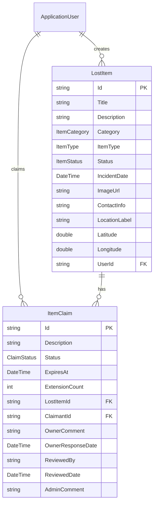

# UniLostItem — Lost & Found Application Architectural Plan

## 1. Finalized Decisions

| #   | Decision           | Detail                                                                                                            |
| --- | ------------------ | ----------------------------------------------------------------------------------------------------------------- |
| 1   | **Roles**          | `BaseUser` + `Admin` (no separate Moderator — Admin handles moderation)                                           |
| 2   | **Item creation**  | Directly `Active` (PendingApproval moderation deferred to Phase 2)                                                |
| 3   | **Category**       | Predefined enum: `Elektronik`, `KimlikKart`, `CantaCuzdan`, `GiysiAksesuar`, `KitapKirtasiye`, `Anahtar`, `Diger` |
| 4   | **Location**       | Flat fields on LostItem: `LocationLabel`, `Latitude`, `Longitude`                                                 |
| 5   | **Photo**          | URL string (file upload deferred)                                                                                 |
| 6   | **Notifications**  | Out of MVP scope                                                                                                  |

### Claim Flow

```
User creates Claim → Pending (ExpiresAt = +2 days)
  ├─ Item poster APPROVES (+ optional comment) → Resolved ✅ (no Admin needed)
  ├─ Item poster REJECTS (+ optional comment)  → RejectedByOwner
  ├─ Item poster does nothing within 2 days:
  │   ├─ Poster clicks "Extend" → +2 days (max 2 extensions = 6 days total)
  │   └─ Admin can step in → ApprovedByAdmin / RejectedByAdmin
  └─ Claimant cancels → Cancelled
```

---

## 2. Roles & Actions

### BaseUser

1. Create lost/found item posting (direct `Active`)
2. Update own posting
3. Delete own posting (soft delete)
4. List own postings
5. List all active postings (paginated, filtered, sorted)
6. View posting details
7. Create claim on another user's posting
8. List own claims
9. Cancel own claim
10. **View claims on own postings**
11. **Approve/Reject claims on own postings** (+ optional comment)
12. **Extend claim deadline** on own postings (max 2 times)

### Admin (inherits all BaseUser actions +)

1. Delete any posting
2. View all claims (including expired)
3. Approve/Reject any claim (escalation/override)

---

## 3. Domain Entities

### 3.1 Enums

#### `Domain/Common/Enums/ItemType.cs`

```csharp
public enum ItemType
{
    Lost = 0,
    Found = 1
}
```

#### `Domain/Common/Enums/ItemStatus.cs`

```csharp
public enum ItemStatus
{
    PendingApproval = 0,  // Phase 2 (not used in MVP)
    Active = 1,
    Rejected = 2,         // Phase 2
    Resolved = 3,
    Flagged = 4           // Reported by users, needs admin review
}
```

#### `Domain/Common/Enums/ItemCategory.cs`

```csharp
public enum ItemCategory
{
    Electronics = 0,        // Phone, tablet, laptop, earbuds
    IdentificationCard = 1, // ID card, driver license, student card, bank card
    BagWallet = 2,          // Backpack, handbag, wallet
    ClothingAccessory = 3,  // Coat, glasses, hat, umbrella
    BookStationery = 4,     // Textbook, notebook, pen set
    Key = 5,                // House, car, bike key
    Documents = 6,          // Passport, diploma, official documents
    HealthMedical = 7,      // Medicine, medical equipment
    Other = 8               // Other
}
```

#### `Domain/Common/Enums/ClaimStatus.cs`

```csharp
public enum ClaimStatus
{
    Pending = 0,
    ApprovedByOwner = 1,  // Item poster confirmed → Item Resolved
    RejectedByOwner = 2,  // Item poster rejected
    ApprovedByAdmin = 3,  // Admin confirmed → Item Resolved
    RejectedByAdmin = 4,  // Admin rejected
    Cancelled = 5         // Claimant cancelled
}
```

### 3.2 LostItem Entity — `Domain/LostItem.cs`

```csharp
public class LostItem : BaseEntity
{
    public required string Title { get; set; }            // max 200
    public required string Description { get; set; }      // max 2000
    public ItemCategory Category { get; set; }
    public ItemType ItemType { get; set; }
    public ItemStatus Status { get; set; } = ItemStatus.Active;  // MVP: direct Active
    public DateTime IncidentDate { get; set; }
    public string? ImageUrl { get; set; }                 // max 500
    public string? ContactInfo { get; set; }              // max 300

    // Location (flat fields)
    public required string LocationLabel { get; set; }    // max 300
    public double Latitude { get; set; }
    public double Longitude { get; set; }

    // Navigation
    public required string UserId { get; set; }
    public ApplicationUser User { get; set; } = null!;
    public ICollection<ItemClaim> Claims { get; set; } = new List<ItemClaim>();
}
```

### 3.3 ItemClaim Entity — `Domain/ItemClaim.cs`

```csharp
public class ItemClaim : BaseEntity
{
    public required string Description { get; set; }      // max 1000
    public ClaimStatus Status { get; set; } = ClaimStatus.Pending;

    // Expiry mechanism
    public DateTime ExpiresAt { get; set; }               // Default: CreatedDate + 2 days
    public int ExtensionCount { get; set; } = 0;          // Max 2

    // Navigation
    public required string LostItemId { get; set; }
    public LostItem LostItem { get; set; } = null!;
    public required string ClaimantId { get; set; }
    public ApplicationUser Claimant { get; set; } = null!;

    // Item poster response
    public string? OwnerComment { get; set; }             // max 500
    public DateTime? OwnerResponseDate { get; set; }

    // Admin review
    public string? ReviewedBy { get; set; }
    public DateTime? ReviewedDate { get; set; }
    public string? AdminComment { get; set; }             // max 500
}
```

### 3.4 ApplicationUser — Navigation additions

```csharp
// Add to existing ApplicationUser.cs:
public ICollection<LostItem> LostItems { get; set; } = new List<LostItem>();
public ICollection<ItemClaim> Claims { get; set; } = new List<ItemClaim>();
```

### 3.5 Entity Relationships



---

## 4. Feature Modules (CQRS)

### 4.1 `Application/Features/LostItems/`

#### Commands

| Folder                     | Command                 | DTO                 | Validator                        | Auth                        |
| -------------------------- | ----------------------- | ------------------- | -------------------------------- | --------------------------- |
| `Commands/CreateLostItem/` | `CreateLostItemCommand` | `CreateLostItemDto` | `CreateLostItemCommandValidator` | `[Authorize]`               |
| `Commands/UpdateLostItem/` | `UpdateLostItemCommand` | `UpdateLostItemDto` | `UpdateLostItemCommandValidator` | `[Authorize]` (owner)       |
| `Commands/DeleteLostItem/` | `DeleteLostItemCommand` | —                   | —                                | `[Authorize]` (owner/Admin) |

#### Queries

| Folder                        | Query                     | Response DTO                       | Validator                  | Auth           |
| ----------------------------- | ------------------------- | ---------------------------------- | -------------------------- | -------------- |
| `Queries/GetLostItemList/`    | `GetLostItemListQuery`    | `PaginatedListDto<GetLostItemDto>` | `GetLostItemListValidator` | AllowAnonymous |
| `Queries/GetLostItemDetails/` | `GetLostItemDetailsQuery` | `GetLostItemDetailDto`             | —                          | AllowAnonymous |
| `Queries/GetMyLostItems/`     | `GetMyLostItemsQuery`     | `PaginatedListDto<GetLostItemDto>` | `GetMyLostItemsValidator`  | `[Authorize]`  |

#### Common DTOs & Enums

**`Queries/Common/DTOs/GetLostItemDto.cs`** — List item (compact):

```csharp
public class GetLostItemDto
{
    public string Id { get; set; } = string.Empty;
    public string Title { get; set; } = string.Empty;
    public string Description { get; set; } = string.Empty;
    public ItemCategory Category { get; set; }
    public ItemType ItemType { get; set; }
    public ItemStatus Status { get; set; }
    public DateTime IncidentDate { get; set; }
    public string? ImageUrl { get; set; }
    public string LocationLabel { get; set; } = string.Empty;
    public double Latitude { get; set; }
    public double Longitude { get; set; }
    public string UserId { get; set; } = string.Empty;
    public string UserFullName { get; set; } = string.Empty;
    public int ClaimCount { get; set; }
    public DateTime CreatedDate { get; set; }
}
```

**`Queries/Common/DTOs/GetLostItemDetailDto.cs`** — Detail view (includes claims if owner/admin):

```csharp
public class GetLostItemDetailDto : GetLostItemDto
{
    public string? ContactInfo { get; set; }
    public string? CreatedBy { get; set; }
    public DateTime? UpdatedDate { get; set; }
    public bool IsActive { get; set; }
}
```

**`Queries/Common/Enums/LostItemSortField.cs`**:

```csharp
public enum LostItemSortField
{
    [Description("title")] Title,
    [Description("category")] Category,
    [Description("incidentdate")] IncidentDate,
    [Description("createddate")] CreatedDate
}
```

**`Commands/CreateLostItem/CreateLostItemDto.cs`**:

```csharp
public class CreateLostItemDto
{
    public required string Title { get; set; }
    public required string Description { get; set; }
    public required ItemCategory Category { get; set; }
    public required ItemType ItemType { get; set; }
    public required DateTime IncidentDate { get; set; }
    public required string LocationLabel { get; set; }
    public required double Latitude { get; set; }
    public required double Longitude { get; set; }
    public string? ImageUrl { get; set; }
    public string? ContactInfo { get; set; }
}
```

**`Commands/UpdateLostItem/UpdateLostItemDto.cs`**:

```csharp
public class UpdateLostItemDto
{
    public required string Title { get; set; }
    public required string Description { get; set; }
    public required ItemCategory Category { get; set; }
    public required DateTime IncidentDate { get; set; }
    public required string LocationLabel { get; set; }
    public required double Latitude { get; set; }
    public required double Longitude { get; set; }
    public string? ImageUrl { get; set; }
    public string? ContactInfo { get; set; }
}
```

---

### 4.2 `Application/Features/ItemClaims/`

#### Commands

| Folder                          | Command                      | DTO                   | Validator                          | Auth                         |
| ------------------------------- | ---------------------------- | --------------------- | ---------------------------------- | ---------------------------- |
| `Commands/CreateItemClaim/`     | `CreateItemClaimCommand`     | `CreateItemClaimDto`  | `CreateItemClaimCommandValidator`  | `[Authorize]`                |
| `Commands/CancelItemClaim/`     | `CancelItemClaimCommand`     | —                     | —                                  | `[Authorize]` (claimant)     |
| `Commands/RespondToClaim/`      | `RespondToClaimCommand`      | `RespondToClaimDto`   | `RespondToClaimCommandValidator`   | `[Authorize]` (item poster)  |
| `Commands/ExtendClaimDeadline/` | `ExtendClaimDeadlineCommand` | —                     | —                                  | `[Authorize]` (item poster)  |
| `Commands/AdminReviewClaim/`    | `AdminReviewClaimCommand`    | `AdminReviewClaimDto` | `AdminReviewClaimCommandValidator` | `[Authorize(Roles="Admin")]` |

#### Queries

| Folder                      | Query                   | Response DTO                        | Validator | Auth                                  |
| --------------------------- | ----------------------- | ----------------------------------- | --------- | ------------------------------------- |
| `Queries/GetClaimsByItem/`  | `GetClaimsByItemQuery`  | `PaginatedListDto<GetItemClaimDto>` | Validator | `[Authorize]` (item poster/Admin)     |
| `Queries/GetMyClaims/`      | `GetMyClaimsQuery`      | `PaginatedListDto<GetItemClaimDto>` | Validator | `[Authorize]`                         |
| `Queries/GetPendingClaims/` | `GetPendingClaimsQuery` | `PaginatedListDto<GetItemClaimDto>` | Validator | `[Authorize(Roles="Admin")]`          |
| `Queries/GetClaimDetails/`  | `GetClaimDetailsQuery`  | `GetItemClaimDto`                   | —         | `[Authorize]` (claimant/poster/Admin) |

#### DTOs

**`Commands/CreateItemClaim/CreateItemClaimDto.cs`**:

```csharp
public class CreateItemClaimDto
{
    public required string LostItemId { get; set; }
    public required string Description { get; set; }
}
```

**`Commands/RespondToClaim/RespondToClaimDto.cs`**:

```csharp
public class RespondToClaimDto
{
    public required bool IsApproved { get; set; }   // true = approve, false = reject
    public string? Comment { get; set; }            // optional reason
}
```

**`Commands/AdminReviewClaim/AdminReviewClaimDto.cs`**:

```csharp
public class AdminReviewClaimDto
{
    public required bool IsApproved { get; set; }
    public string? Comment { get; set; }
}
```

**`Queries/Common/DTOs/GetItemClaimDto.cs`**:

```csharp
public class GetItemClaimDto
{
    public string Id { get; set; } = string.Empty;
    public string Description { get; set; } = string.Empty;
    public ClaimStatus Status { get; set; }
    public DateTime ExpiresAt { get; set; }
    public int ExtensionCount { get; set; }
    public string LostItemId { get; set; } = string.Empty;
    public string LostItemTitle { get; set; } = string.Empty;
    public string ClaimantId { get; set; } = string.Empty;
    public string ClaimantFullName { get; set; } = string.Empty;
    public string? OwnerComment { get; set; }
    public DateTime? OwnerResponseDate { get; set; }
    public string? ReviewedBy { get; set; }
    public DateTime? ReviewedDate { get; set; }
    public string? AdminComment { get; set; }
    public DateTime CreatedDate { get; set; }
}
```

---

## 5. API Endpoints

### 5.1 LostItemsController — `/api/v1/items`

| HTTP     | Route       | Auth                        | Description                                                                      |
| -------- | ----------- | --------------------------- | -------------------------------------------------------------------------------- |
| `GET`    | `/`         | AllowAnonymous              | List active items (paginated, filtered by category/type/search/location, sorted) |
| `GET`    | `/{id}`     | AllowAnonymous              | Get item details                                                                 |
| `POST`   | `/`         | `[Authorize]`               | Create new item (direct Active)                                                  |
| `PUT`    | `/{id}`     | `[Authorize]` (owner)       | Update own item                                                                  |
| `DELETE` | `/{id}`     | `[Authorize]` (owner/Admin) | Soft-delete item                                                                 |
| `GET`    | `/my-items` | `[Authorize]`               | List own items                                                                   |

### 5.2 ItemClaimsController — `/api/v1/claims`

| HTTP   | Route                   | Auth                                  | Description                               |
| ------ | ----------------------- | ------------------------------------- | ----------------------------------------- |
| `POST` | `/`                     | `[Authorize]`                         | Create claim on an item                   |
| `GET`  | `/{id}`                 | `[Authorize]` (claimant/poster/Admin) | Get claim details                         |
| `GET`  | `/my-claims`            | `[Authorize]`                         | List my submitted claims                  |
| `PUT`  | `/{id}/cancel`          | `[Authorize]` (claimant)              | Cancel own claim                          |
| `GET`  | `/by-item/{lostItemId}` | `[Authorize]` (item poster/Admin)     | List claims for a specific item           |
| `PUT`  | `/{id}/respond`         | `[Authorize]` (item poster)           | Approve/Reject claim as item poster       |
| `PUT`  | `/{id}/extend`          | `[Authorize]` (item poster)           | Extend claim deadline (+2 days, max 2x)   |
| `PUT`  | `/{id}/admin-review`    | `[Authorize(Roles="Admin")]`          | Admin approve/reject claim                |
| `GET`  | `/pending`              | `[Authorize(Roles="Admin")]`          | List all pending claims (Admin dashboard) |

**Total: 15 endpoints** (6 LostItems + 9 ItemClaims)

---

## 6. EF Core Configuration

### OnModelCreating

```csharp
// LostItem
builder.Entity<LostItem>(entity =>
{
    entity.Property(e => e.Title).HasMaxLength(200).IsRequired();
    entity.Property(e => e.Description).HasMaxLength(2000).IsRequired();
    entity.Property(e => e.LocationLabel).HasMaxLength(300).IsRequired();
    entity.Property(e => e.ImageUrl).HasMaxLength(500);
    entity.Property(e => e.ContactInfo).HasMaxLength(300);

    entity.HasOne(e => e.User)
          .WithMany(u => u.LostItems)
          .HasForeignKey(e => e.UserId)
          .IsRequired()
          .OnDelete(DeleteBehavior.Restrict);

    entity.HasIndex(e => e.UserId);
    entity.HasIndex(e => e.Status);
    entity.HasIndex(e => e.ItemType);
    entity.HasIndex(e => e.Category);
});

// ItemClaim
builder.Entity<ItemClaim>(entity =>
{
    entity.Property(e => e.Description).HasMaxLength(1000).IsRequired();
    entity.Property(e => e.OwnerComment).HasMaxLength(500);
    entity.Property(e => e.AdminComment).HasMaxLength(500);

    entity.HasOne(e => e.LostItem)
          .WithMany(l => l.Claims)
          .HasForeignKey(e => e.LostItemId)
          .IsRequired()
          .OnDelete(DeleteBehavior.Restrict);

    entity.HasOne(e => e.Claimant)
          .WithMany(u => u.Claims)
          .HasForeignKey(e => e.ClaimantId)
          .IsRequired()
          .OnDelete(DeleteBehavior.Restrict);

    entity.HasIndex(e => e.LostItemId);
    entity.HasIndex(e => e.ClaimantId);
    entity.HasIndex(e => e.Status);
});
```

---

## 7. Implementation Order

### Step 1: Domain Layer — Enums & Entities

- [x] `Domain/Common/Enums/ItemType.cs`
- [x] `Domain/Common/Enums/ItemStatus.cs`
- [x] `Domain/Common/Enums/ItemCategory.cs`
- [x] `Domain/Common/Enums/ClaimStatus.cs`
- [x] `Domain/LostItem.cs`
- [x] `Domain/ItemClaim.cs`
- [x] `Domain/ApplicationUser.cs` — add navigation properties

### Step 2: Persistence Layer — DbContext & Migration

- [x] `Persistence/IAppDbContext.cs` — add `DbSet<LostItem>`, `DbSet<ItemClaim>`
- [x] `Persistence/AppDbContext.cs` — add DbSets + OnModelCreating config
- [x] `Persistence/DbInitializer.cs` — optional sample seed data
- [x] Run: `dotnet ef migrations add AddLostItemAndClaimEntities -p Persistence -s API`
- [x] Run: `dotnet ef database update -p Persistence -s API`

### Step 3: LostItems Feature — Commands

- [x] `CreateLostItem/` — Command, Handler, DTO, Validator
- [x] `UpdateLostItem/` — Command, Handler, DTO, Validator
- [x] `DeleteLostItem/` — Command, Handler

### Step 4: LostItems Feature — Queries

- [x] `Queries/Common/DTOs/GetLostItemDto.cs`, `GetLostItemDetailDto.cs`
- [x] `Queries/Common/Enums/LostItemSortField.cs`
- [x] `GetLostItemList/` — Query, Handler, Validator
- [x] `GetLostItemDetails/` — Query, Handler
- [x] `GetMyLostItems/` — Query, Handler, Validator

### Step 5: LostItems — Mapping & Controller

- [x] `Application/Core/MappingProfiles.cs` — LostItem mappings (query mapping uses projection, not AutoMapper)
- [x] `API/Controllers/Requests/GetLostItemsRequest.cs`
- [x] `API/Controllers/LostItemsController.cs`
- [x] Build & test LostItems in isolation

### Step 6: ItemClaims Feature — Commands

- [x] `CreateItemClaim/` — Command, Handler, DTO, Validator
- [x] `CancelItemClaim/` — Command, Handler
- [x] `RespondToClaim/` — Command, Handler, DTO, Validator
- [x] `ExtendClaimDeadline/` — Command, Handler
- [x] `AdminReviewClaim/` — Command, Handler, DTO, Validator

### Step 7: ItemClaims Feature — Queries

- [x] `Queries/Common/DTOs/GetItemClaimDto.cs`
- [x] `Queries/Common/Enums/ItemClaimSortField.cs`
- [x] `GetClaimsByItem/` — Query, Handler, Validator
- [x] `GetMyClaims/` — Query, Handler, Validator
- [x] `GetClaimDetails/` — Query, Handler
- [x] `GetPendingClaims/` — Query, Handler, Validator

### Step 8: ItemClaims — Mapping & Controller

- [x] `Application/Core/MappingProfiles.cs` — ItemClaim mappings
- [x] `API/Controllers/Requests/GetClaimsByItemRequest.cs`
- [x] `API/Controllers/Requests/GetMyClaimsRequest.cs`
- [x] `API/Controllers/Requests/GetPendingClaimsRequest.cs`
- [x] `API/Controllers/ItemClaimsController.cs`

### Step 9: Build & Test

- [x] `dotnet build UniLostItem.sln`
- [x] `Tests/Features/LostItems/` — unit tests
- [x] `Tests/Features/ItemClaims/` — unit tests (55 new tests)
- [x] `dotnet test`

---

## 8. Existing Infrastructure Changes

### Files to Modify

| File                                                                                                                            | Change                                                                                          |
| ------------------------------------------------------------------------------------------------------------------------------- | ----------------------------------------------------------------------------------------------- |
| [ApplicationUser.cs](file:///c:/Users/SERHAN/Desktop/codebase/mydotnetprojects/UniLostItem/Domain/ApplicationUser.cs)           | Add `ICollection<LostItem> LostItems` and `ICollection<ItemClaim> Claims` navigation properties |
| [AppDbContext.cs](file:///c:/Users/SERHAN/Desktop/codebase/mydotnetprojects/UniLostItem/Persistence/AppDbContext.cs)            | Add `DbSet<LostItem>`, `DbSet<ItemClaim>` + OnModelCreating configuration                       |
| [IAppDbContext.cs](file:///c:/Users/SERHAN/Desktop/codebase/mydotnetprojects/UniLostItem/Persistence/IAppDbContext.cs)          | Add `DbSet<LostItem>`, `DbSet<ItemClaim>` properties                                            |
| [DbInitializer.cs](file:///c:/Users/SERHAN/Desktop/codebase/mydotnetprojects/UniLostItem/Persistence/DbInitializer.cs)          | Optional sample lost item seed data                                                             |
| [MappingProfiles.cs](file:///c:/Users/SERHAN/Desktop/codebase/mydotnetprojects/UniLostItem/Application/Core/MappingProfiles.cs) | Add LostItem and ItemClaim AutoMapper mappings                                                  |

### Files NOT Changed

- `Program.cs` — existing extension pattern sufficient
- `IdentityServiceExtensions.cs` — `.AddRoles<IdentityRole>()` already enabled
- `BaseApiController.cs` — `HandleResult` pattern sufficient
- `Result.cs` — no change
- `JwtService.cs` — roles already added to claims (`ClaimTypes.Role`)
- `Auth` feature — untouched

---

## 9. Phase 2 (Deferred)

> [!NOTE]
> These features are architecturally planned but NOT implemented in MVP.

- **Item moderation**: `PendingApproval` → Admin reviews → `Active`/`Rejected`
  - `ReviewLostItemCommand`, `GetPendingLostItemsQuery`, `/pending` & `/{id}/review` endpoints
- **File upload**: Replace `ImageUrl` string with actual file upload service
- **Location entity**: Extract to separate `Location` table with `PlaceId` for OpenStreetMap
- **Notification system**: Email/push on claim status changes
- **Auto-expire claims**: Background job to mark expired claims

---

## Verification Plan

### Automated

```bash
dotnet build UniLostItem.sln
dotnet test
```

### Manual

1. Run migration and verify database schema
2. Test all endpoints via Swagger UI
3. Role-based auth: BaseUser token → Admin endpoint → expect 403
4. Claim flow: Create item → Create claim → Owner respond → verify Resolved
5. Extend deadline: Verify max 2 extensions enforced
6. Soft delete and pagination validation

---

## 10. Implementation Notes (Deviations from Plan)

### Auth Simplifications

| Endpoint | Plan | Actual | Reason |
|----------|------|--------|--------|
| `GET /claims/by-item/{lostItemId}` | item poster **or Admin** | item poster only | Admin can use pending claims endpoint; simplifies handler |
| `GET /claims/{id}` | claimant **or poster or Admin** | claimant or poster only | Admin escalation via AdminReview handles override scenario |
| `GET /claims/pending` | Admin only | Admin only (no handler auth, controller `[Authorize(Roles="Admin")]`) | Defense in depth — controller-level auth sufficient |

### Other Notes

- **Step 5** included `UpdateLostItem` and `DeleteLostItem` validators not listed in Step 3 plan — added for consistency
- **Step 9** added `GetMyLostItemsQueryHandlerTests` (not in original plan) — tests for existing feature
- **Total test count**: 554 (499 existing + 55 new ItemClaims tests)
- **AutoMapper**: Only used for `CreateItemClaimDto → ItemClaim`; queries use `.Select()` projection
- **No `Mock<IAppDbContext>`**: All handlers use real `AppDbContext` via `TestDbContextFactory` (SQLite in-memory)
